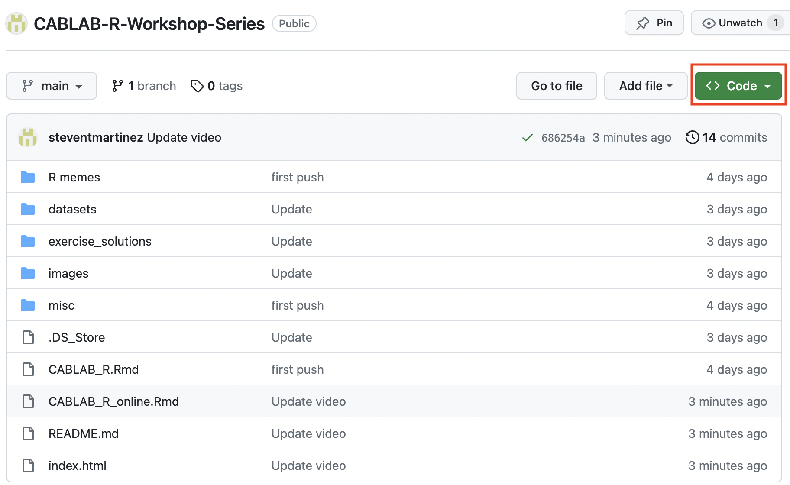

```{r setup, include=FALSE}

knitr::opts_chunk$set(echo = TRUE, error = FALSE)

```


```{r establish root directory, include=FALSE}

require(knitr)
opts_knit$set(root.dir = '/Users/tuh20985/Desktop/CABLAB-R-Workshop-Series-main/')

```

# Description

This workshop will provide an introduction into R! 

R is a popular programming language that many researchers use for organizing data, visualizing data, and carrying out statistical analyses.

By the end of the workshop series, my hope is that you will feel comfortable enough to work independently in R!


```{r Intro Video, echo = FALSE}
vembedr::embed_url("https://www.youtube.com/watch?v=HluANRwPyNo")
```
[**Coding expectations versus reality**]


## Outline

| **Pre-Workshop**: Downloading R Software | **R**: https://ftp.osuosl.org/pub/cran/ **RStudio**: https://posit.co/download/rstudio-desktop/
| **Week 1: Intro to R** | Learning how to navigate the software: R, RStudio, Console, and creating scripts in R Markdown
| **Week 2: Installing and Loading Packages** | Continue orienting to the software environment using the "swirl" package
| **Week 3: Working Directories** | Learn how to navigate working directories and read in data into R
| **Week 4: Subsetting in R** | Understand how to access rows and columns and filter observations
| **Week 5: If Else statements** | Using the ifelse() function to create new columns
| **Week 6: Intro to For Loops in R** | Learning the structure and application of For loops in R
| **Week 7: Pivoting data from wide to long and long to wide** | Understanding the differences between data in wide-format and long-format
| **Week 8: Merging data frames** | Merging two data frames together
| **Week 9: Analyzing Data w/ Categorical Independent Variables** | Conducting statistical analyses with categorical predictors
| **Week 10: Analyzing Data w/ Continuous Independent Variables** | Conducting statistical analyses with continuous and categorical predictors
| **Week 11: Visualizing data: Intro to ggplot** | Learn how to create ggplot visualizations and customize plots
| **Final Project?** | TBD 
| **Conclusion** | Closing and general notes


# Pre-Workshop: Downloading R Software 

Before the workshop:

1. Download a **R CRAN Mirror**, which basically just hosts the R programming language that we will be using in RStudio. https://cran.r-project.org/

2. Download **RStudio**, which is the main software that we will be using to work with R. https://posit.co/download/rstudio-desktop/

3. Download the 'CABLAB-R-Workshop-Series' folder from the CABLAB R Workshop Github by pressing the green 'Code' button and downloading the ZIP folder. This is the folder containing the all the files we will be working with for the purposes of this workshop.


{width=100%}


# Week 1: Intro to R 

## Opening a new R Markdown File

To get things started, open R Studio. Then, let's try opening a new R Markdown document, by clicking File > New File > R Markdown...

{width=100%}

This should produce a dialogue box where you can enter the name of the script and your name before selecting OK.

{width=40%}

Next, let's clear out all of the default text that appears in a new R Markdown document, which I have highlighted below:

{width=70%}


## Intro to R Markdown

In a typical coding script, every line must contain code that the language could interpret. If you want to include notes, you have to include a hash mark (#) before any code in order for the program to “ignore this line”. So, in order to leave ourselves any notes, we had to use hash marks, which can get a bit annoying. However, an R Markdown script does the same things as a typical coding script, but it's more user friendly.

With R Markdown, any code that you would like R to interpret belongs in the coding chunk as illustrated below!

{width=35%}

If we want to leave notes, we don’t have to “comment it out”. We can just write long-winded narration that can help others understand why we coded what we coded and what that code does. 

That’s because a typical script will interpret any text as a command, unless the text is otherwise marked by a hashtag (#). An R markdown script only interprets things as code when we tell it to, and we tell it what is code by creating a chunk. Chunks are marked by three backticks (```) followed by a {r} and, on another line, three more backticks.

{width=35%}

A typical script can’t make sense of this, though. We need to use R markdown scripts to do it. You might be thinking, though, that manually denoting code from non-code seems like extra work, and it is a little bit, but it can also be a lot more convenient because the output of any given chunk will appear in the R Studio Console Window. By output, we just mean the product, sum, or status of whatever calculation or item you are asking R to compute and show you.

R Markdown grants us greater control over what we see and when we see it. To demonstrate, let’s start by creating a new chunk in our markdown document and entering what we see in the image above, you can then follow along with the next bit:

```{r add 2 plus 2}

2 + 2

```


With a typical script, if we want to know the output of a line we ran awhile ago, we either have to rerun it or scroll through the console to find it. With Markdown we can minimize entire chunks and their output by using the minimization button [] on the left side of the window. 

If we want to hide output, we can use the expand/collapse button [] on the right side of the output window.

We can choose exactly what we want to run using the the "*Run*" command [] in the upper right corner of the chunk.

Also of note, the down-facing arrow (second icon in the upper right corner of the code block) will tell R "Run all of the blocks of command that I have before this block" []. It can be helpful if you make a mistake and don't want to manually rerun all of the previous blocks one by one to get back to where you were. It also makes your code very easy for other people to run. They can quite literally do it with the click of a button! 

If we click the cog icon in the same tray, we can access the output options and manipulate where output appears and what it looks like, but that's beyond the scope of this review [].


# Week 2: Installing and Loading Packages

## What's a "Package"?

Packages in R are synonymous with libraries in other languages. They are more or less convenient short-cuts or functions someone else already programmed to save us some work. Somebody else already figured out a very quick way to compute a function so now we don’t have to! We just use their tools to do it.

Every new package is centralized in R’s repository, so even though thousands of people are working on these things independently, you don’t need to leave R to find them. Before they can be used, they must be installed, and you can do that pretty simply:

```{r install packages, eval = F}

install.packages("PACKAGENAME")

```

If you need to update a package, you can just re-run the above code. If you’re using R Studio, you can also see a list of your packages and their associated descriptions in the ‘Packages’ Tab of your Viewer Window.

{width=50%}


Now we’ve installed a package, that doesn’t mean we can use it yet. We need to tell R “We want access to the functions this package has during this session" by calling it with the library() command.

```{r load package via library, eval = F}

library(PACKAGENAME)

```

Notice that we drop the quotation marks now. We just specify the (case-sensitive) package name and it lets R know we are planning on using that this session.

You might be wondering why we need to take this extra step. Sometimes different packages use the same commands, so having more than one of those active at the same time could confuse R (When this does happen, R will usually tell you). Sometimes packages take up a lot of disk space, so having ALL of your packages initialized at once might leave your computer running extremely slow. It’s the same for most languages.

If we ever want to explore the functions contained within a package in conjunction with examples, we can either go to the R documentation website or type ‘??PackageName’ into the Console, which will then populate the Help Tab of the Viewer Window with information on the package.

Let's try installing and loading in a few package for practice. Let's install and load the following packages in R: naniar, report, tidyverse, dplyr, Matrix, lme4, lmerTest, and ggplot2

## Week 2 Exercise: Installing and Loading Packages
```{r Week 2 Exercise, code="'\n\n\n\n'", results=F}


  
```


```{r Week 2 Exercise - hidden, eval=T, include=F}

install.packages("naniar", repos = "http://cran.us.r-project.org")
install.packages("report", repos = "http://cran.us.r-project.org")
install.packages("tidyverse", repos = "http://cran.us.r-project.org")
install.packages("dplyr", repos = "http://cran.us.r-project.org")
install.packages("Matrix", repos = "http://cran.us.r-project.org")
install.packages("lme4", repos = "http://cran.us.r-project.org")
install.packages("lmerTest", repos = "http://cran.us.r-project.org")
install.packages("ggplot2", repos = "http://cran.us.r-project.org")

library(naniar)
library(report)
library(tidyverse)
library(dplyr)
library(Matrix)
library(lme4)
library(lmerTest)
library(ggplot2)

```

[Click for solution](https://github.com/steventmartinez/CABLAB-R-Workshop-Series/blob/main/exercise_solutions/week2_exercise.R)


##  Week 2 Assignment: Install and Load "swirl" library and complete "R Programming: The basics of programming in R"  
Swirl is a really cool package in R that teaches you R programming and data science interactively, at your own pace, and right in the R console! For our first assignment, I think swirl explains some fundamental concepts in a way better than I can, so let's complete the **"R Programming: The basics of programming in R"** which includes modules 1 (Basic Building Blocks) - 7 (Matrices and Data Frame) in swirl.

Some of it will make sense, and some of it won't (and that's okay!), but I think swirl does a pretty good job of orienting people to how basic operations in R work, and I think this is especially helpful before we start working with any actual data. 

Let's give this a try and we can talk through any problems people ran into during our next workshop. I've attached some screenshots below demonstrating how to install and load swirl().

{width=70%}


{width=70%}


# Week 3: Working Directories 

## Working Directories in R: What is a Working Directory?

Hopefully swirl() has helped you feel a bit more comfortable in navigating R. Today we will focus on working with directories in R.

A working directory is a fancy term that refers to the default location where R will look for files you want to load and where it will put any files you save. Like any other language or program, R needs to be told where the data that we’d like to work with is located on our computer. It doesn’t just know automatically. 

Below we'll use the getwd() command to check out where where your current working directory is.

Using the list.files() command will show you what files exist in your current working directory.

```{r}

getwd() #get your current working directory

list.files() #Use list.files() to check the contents of your working directory


```


## Working Directories in R: Specifying your Working Directory

In order to work with the data that we want to work with, we’ll have to tell R where the files are located, so we can create a new variable containing a filepath to make this process simple so we aren’t writing it out multiple times. Filepaths will differ based on whether you are using a Windows versus a Mac. If you're using a Windows computer, it's likely your file path will exist within your "C:/ Drive". If you're on a Mac, it's likely your file path will start with a forward slash "/". If you're not sure of your path, R makes it relatively easy to find it.

You can press tab when your cursor is to the left of the slash to see a list of directories contained within your computer.

```{r Setting Working Directory Example, eval=FALSE,include=TRUE, message=FALSE, warning=FALSE, error=FALSE}
# For Windows
Path <- "C:/"

# For Mac
Path <- "/"
``` 

Here’s an example of what you should see:

{width=40%}


Pressing tab again will enter into a directory, thus showing me the contents of that directory. From there, I can keep hitting tab until I get to the directory, or folder, that contains the files I want to work with. I can then save this filepath, which is just what we call a string (i.e., text that does not contain a quantitative value), as an object named Path. We do so by placing the object on the left of an equal sign (=) or an arrow (<-) and the value that object is taking on the right side of it.

Below, let's assign the filepath where our CABLAB R Workshop Series folder exists to an object called "Path".

```{r Assign working directory to object called "Path"}

# For Windows
Path <- "C:/Users/tuh20985/Desktop/CABLAB-R-Workshop-Series-main/datasets/"

# For Mac
Path <- "/Users/tuh20985/Desktop/CABLAB-R-Workshop-Series-main/datasets/"

```

This format of assigning a value to an object is really important and we’ll keep coming back to it throughout this tutorial!


## Intro to "Fright Night" dataset
For the purposes of this project, we are going to work with the Fright Night dataset! The Fright Night project took place in 2021 at the Eastern State Penitentiary's annual "Halloween Nights" haunted house event in Philadelphia. 116 participants completed a haunted house tour as part of a research study assessing the relationship between threat and memory. 

Specifically, we explored 2 main research questions: 1) How does naturalistic threat affect memory accuracy?; and 2) Does naturalistic threat affect the way in which we communicate our memories? 

{width=60%}

Participants toured four haunted house segments (Delirium, Take 13, Machine Shop, and Crypt) that included low-threat and high-threat segments. Delirium and Take 13 were low-threat segments, whereas Machine Shop and Crypt were high-threat segments. 

To assess memory accuracy, we focused on temporal memory accuracy specifically. Temporal memory refers to memory for the order in which events occur. To measure temporal memory within our study, we focused on accuracy on the recency discrimination task that participants completed for each haunted house segment. As part of the recency discrimination task, participants were shown pairs of trial-unique events within each haunted house segment and asked to select which event came first. In this way, we can determine the accuracy of people's temporal memory for the order of the events they experienced. 


{width=70%}


{width=70%}


{width=70%}


To assess communication styles during memory recall, we focused on the free recall memory task where we asked participants to freely recall their memory for each haunted house segments. We fed the free recall memory transcripts into a natural language processing instrument called the Linguistic Inquiry and Word Count (LIWC) software. LIWC calculates the percentage of words in a given text that belong to linguistic categories that have been shown to index psychosocial constructs. In the example attached below, you can see the percentage of words that contribute to a linguistic category called "Authenticity" which is thought to reflect perceived honesty and genuineness, and the percentage of words that belong to a linguistic category called "Analytical Thinking", which is thought to reflect formal or logical thinking.

{width=70%}


There were also 3 experimental conditions: Control, Share, and Test.

**Control condition**: Participants were instructed to tour the haunted house segment as they normally would.

**Share condition**: Participants were instructed to tour the haunted house segment in anticipation of an opportunity to post about their experience on social media afterwards.

**Test condition**: Participants were instructed to tour the haunted house segment in anticipation of being tested on their knowledge of the haunted house segment afterwards.

For the first two segments (Delirium and Take 13), all participants toured the segment in the Control condition. However, in the last two segments (Crypt and Machine Shop), some participants toured the segments in the Control condition, other participants toured Machine Shop in the Share condition and Crypt in the Test condition, while other participants toured Machine Shop in the Test condition and Crypt in the Share condition.

After completing the haunted house tour, participants were assessed at two time points: immediately afterwards and again 1-week later. During the Immediate assessments, participants completed a recency discrimination task and freely recalled their memory for 1 low-threat and 1-high threat haunted house segment. During the one week-delay assessments, participants completed a recency discrimination task and freely recalled their memory for *all* haunted house segments. Check out the study design below as well as the vignette illustrating when the three experimental conditions (i.e., Control, Share, and Test) took place throughout the haunted house tour.

{width=60%}


Now that we have a better idea about the study design, we can finally start working with some data!

The dataset that we will be working with for the purposes of the workshop is titled **frightnight_practice.csv**.

## What is a "data frame"?
Before we load in the data, I want to highlight a little terminology. The data that R works with is always contained within what we call a ‘dataframe’. A dataframe represents the same thing that a spreadsheet represents in Excel. It contains many cells that are situated into columns (which have names) and rows (which may or may not have names). 


## How do I load data into R?
There are many ways to load data into R and they all depend upon what format the data is in. R can handle data from .csv, .xlsx, .txt, .html, .json, SPSS, Stata, SAS, among others. R also has it’s own data format (.RDA, .Rdata). With the exception of .RDA, .csv is often the cleanest means of reading in data. We won’t cover the other formats, but they are fairly exhaustively covered *<hyperlink/in this tutorial/>*. https://www.datacamp.com/tutorial/r-data-import-tutorial

Before reading in our fright night practice data CSV file, we need to use the setwd() function to tell R where to look for our CSV file. Let's use the Path object that we created earlier.

In the most basic sense, we can load our fright night practice data CSV data file using the read.csv() function like this:
```{r setting working directory}

setwd(Path) #use the setwd() function to assign the "Path" object that we created earlier as the working directory
df <- read.csv(file = "frightnight_practice.csv") #Load in the fright night practice csv file

```


The setwd() command accepts our Path variable and tells R where to look for our .csv file. The read.csv() command actually loads in the data. If done correctly, we should see our R Environment populate with a dataframe labeled df.

{width=70%} 

A visualization of the Environment Window. Note that the number of observations and variables may be different from the dataframe you are currently reading in.
If you click on df in the environment, it will open in a new tab of your Source Window (The same window you are likely writing script in) where you can view it. However, we can also look at the data in our markdown file though by entering the head() command from base R, which will show us the first few lines:

```{r eval = FALSE}

head(df) #will show you a subset of rows within the Data Frame
View(df) #will open up the full data frame like you would in Excel

```


Amazing! Now we have hundreds of columns of data, like we should. We might also notice that the first row of column is PID, which refers to each participant's ID. You'll see that each participant has 6 rows. Remember that there were two stages of assessment: 1) Immediately after the haunted house tour; and 2) A delay 1-week later. Participants were tested on 2 of the 4 haunted house segments during the Immediate Stage, and they were tested on all 4 haunted house segments during the One-Week Delay stage. As a result, every participant should have 6 rows.

**PID** column -- The participant IDs.

**Section** column -- The name of each haunted house segment.

**Stage** column -- Whether the assessment was immediately afterwards or 1 week later.

**Condition** column -- Participants completed the haunted house segment in the Baseline, Share, or Test condition.

**Fear.rating** column -- Participants were also asked to rate how fearful they found each haunted house segment immediately afterwards.

**TOAccuracy** column -- Their accuracy score on the recency discrimination task for each haunted house segment

**Recall** column -- their free recall for each haunted house segment


## Week 3 Exercise: Working Directories

**1)** Read in the df_wide CSV file and store it in an object called "df_wide"

**2)** Print out the first few rows using the head() function

**3)** Open up the df_wide dataframe by using the View() function OR by clicking on the df_wide dataframe in the global environment
```{r Week 3 Exercise, code="'\n\n\n\n'", results=F}


  
```

```{r Week 3 Exercise - hidden, eval=F, include=F}

# For Mac
Path <- "/Users/tuh20985/Desktop/CABLAB-R-Workshop-Series-main/datasets/"

#set working directory
setwd(Path) #use the setwd() function to assign the "Path" object that we created earlier as the working directory

#Read in the df_wide CSV file
df_wide <- read.csv(file = "df_wide.csv")

#head()
head(df_wide)

#View()
View(df_wide)

```

[Click for solution](https://github.com/steventmartinez/CABLAB-R-Workshop-Series/blob/main/exercise_solutions/week3_exercise.R)


## Week 3 Assignment: Working Directories 
There will be no week 3 assignment :) 


# Week 4: Subsetting data

By looking at the dataframe, we can see that we aren’t working with a perfectly clean dataset: some of the rows have missing data! And we don't really need all of the columns in the dataframe to do the analyses that we're interested in doing.

So how do we access rows? How do we access columns? And how can we check what data is missing?

dataframe$column will print out all the rows in that column. Let's print out all the participant IDs that exist in the data frame.

For the purposes of this week's workshop, let's read in the frightnight_practice CSV file

```{r}

# For Mac
Path <- "/Users/tuh20985/Desktop/CABLAB-R-Workshop-Series-main/datasets/"

#set working directory
setwd(Path) #use the setwd() function to assign the "Path" object that we created earlier as the working directory

df <- read.csv(file = "frightnight_practice.csv") #Load in the fright night practice csv file


```


```{r}

df$PID 

```


What if we want to see a specific row? Let’s say row 2 within that column? To reference a specific row in a given column, I can add brackets and the number of that row behind it:

The code below will print out the second row in the PID column.

```{r}

df$PID[2]


```


However, we can also index the column using it’s relative position. Knowing that the PID column is the first column, I can use bracket notation. Bracket notation is super helpful once you understand its structure. It helps me to think of it as [rows, columns]. Any number that appears before the comma will reference rows, and any number that appears after the comma will reference columns.

By including the name of the data frame before the bracket notation, we can pull certain rows and columns from that data frame

```{r}

df[1,] # print the first row across all columns
df[,2] # print column 2
df[1,2] # print the first row in column 2


```

Now that we know how to reference rows and columns, let's talk about subsetting! Subestting is when we filter rows or columns in a given data frame.

## Conditional Subsetting

Let's say we only cared about participants' experiences for the Infirmary section of the haunted house. In order to do this, let's talk about how operators work in R.

```{r}

#print TRUE or False for whether a row in the Section column reflects "Infirmary" or not
df$Section == "Infirmary" 

```

Notice the two equals signs (==). When two value operators (=, >, <, !) are placed next to each other in R, and many other languages, we aren’t assigning a value to an object; we are comparing the values between two different objects. In this instance, using two equals signs, if the two values are equal, it would produce a TRUE value; if not, then a FALSE. This variable which can only take the value of either True or False is called a boolean. When we tell R to compare the value on the right with this specific column, what it is mechanically doing is iterating through each row within this column, comparing the column value, and noting whether the conditional is True or False


## Subsetting rows!

So, we could theoretically plug just about any conditional statement in our subset approaches and subset the data as we wish:

Approach 1 will show how to subset specific rows that we care about using bracket notation.

Approach 2 will show how to subset specific rows using the very popular subset() function

Let's subset the rows that belong to participant 1001.
```{r}

# The nrow() command outputs how many rows the data frame has
# We're doing this to show that both approaches yield the same result

# Approach 1: Bracket notation
df_1001 <- df[df$PID == "1001",]
nrow(df_1001)


#Approach 2: subset() function
df_1001 <- subset(df, PID == "1001")
nrow(df_1001)

```


## Subsetting rows based on multiple conditions

What if, rather than subsetting based on one condition (i.e., rows that belong to participant 1001), we wanted to subset based on multiple conditions? 

We can take advantage of OR (i.e., |) and AND (i.e., &) operators.

Below, we will be subsetting all rows where the assessment is based on the Infirmary or Asylum haunted house segments.
```{r}

df_multiple_conditions <- subset(df, Section == "Infirmary" | Section == "Asylum")

```


Here, we are telling R to subset all rows where Section is equal to Infirmary OR Asylum. As you can tell, leveraging the OR (|) or ANd (&) operators within the subset() function can be especially powerful.


Now that we've talked about subsetting rows, let's talk about subsetting columns.

## Subsetting columns!

As mentioned above, we can also subset columns! We can use the same 2 approaches (bracket notation and subset() function) to subset columns

Approach 1 will show how to subset specific columns that we care about using bracket notation.

Approach 2 will show how to subset specific columns using the same subset() function

Let's subset the following columns: PID, Section, Stage, Recall

```{r}

# Approach 1: Bracket notation
cols <- c("PID", "Section", "Stage", "Recall") #create a vector of column names that we want to subset
df_sub <- df[, cols] #use bracket notation to pull the columns that we included in the "cols" vector from the df data frame.


#Approach 2: subset() function
df_sub <- subset(df, select=c(PID, Section, Stage, Recall))

```


## Week 4 Exercise: Subsetting data

**1)** Create a new data frame called "df2" and subset the following columns from the df data frame: PID, Section, Stage, Fear.rating, and TOAccuracy.

**2)** Do this using bracket notation

**3)** Repeating this using the subset() function.
```{r Week 4 Exercise, code="'\n\n\n\n'", results=F}


  
```

```{r Week 4 Exercise - hidden, eval=T, include=F}

#Create a new data frame called "df2" and subset the following columns from the df data frame: PID, Section, Stage, Fear.rating, and TOAccuracy
# Approach 1: Bracket notation
cols <- c("PID", "Section", "Stage", "Fear.rating", "TOAccuracy") #create a vector of column names that we want to subset
df2 <- df[, cols] #use bracket notation to pull the columns that we included in the "cols" vector from the df data frame.


#Approach 2: subset() function
df2 <- subset(df, select=c(PID, Section, Stage, Fear.rating, TOAccuracy))

```

[Click for solution](https://github.com/steventmartinez/CABLAB-R-Workshop-Series/blob/main/exercise_solutions/week4_exercise.R)


## Missing data 

What if we wanted to see which rows had missing values (e.g., NA) or not?

Let's use the is.na() function to determine which rows have missing values in the TOAccuracy column

```{r}

is.na(df$TOAccuracy)

```

This will produce an array of TRUEs and FALSEs of the same length as the rows in the dataframe, because each individual TRUE and FALSE is telling us whether each row in that column meets the condition we defined. If we see a FALSE in the first position, we know that the first row does NOT have a missing value. If we see a TRUE, we know that the second row does NOT have a Temporal Memory accuracy score. 

But how can we create a data frame that does not have any missing data (i.e., rows that are blank or have an 'NA' in it)?

Here, we can use bracket notation to create a new data frame called "df_complete" that only includes data that is NOT missing in the TOAccuracy column in the df data frame. By putting an exclamation point in front of the is.na() function, this is our way of telling R that we want it to do the inverse of the is.na() function!
```{r}

#is.na() function
df_complete <- df[!is.na(df$TOAccuracy),]


```


What if, instead of removing rows that have a missing value in ONE column, we wanted to remove any rows that have a missing value in ANY column?

Rather than using the is.na() function, I personally like to use the complete.cases() function for situations like this.

```{r}

df_complete <- df[complete.cases(df), ]

```

Here, we are again using bracket notation to tell R, within the df data frame, remove any rows that have a missing value in ANY column in the df data frame. Push the remaining non-empty rows into a new data object called "df.complete".


## Week 4 Assignment: Subsetting data

For this week's assignment, let's continue focusing on subsetting in R.

**1)** Create a new data frame and subset the following columns from the df data frame: PID, Section, Stage, Recall, TOAccuracy

**2)** Create a subset of the data that only contains TOAccuracy scores greater than .40

**3)** Remove any rows that have a missing value in any column

```{r Week 4 Assignment, code="'\n\n\n\n'", results=F}


  
```

```{r Week 4 Assignment - hidden, eval=T, include=F}

#Subset the following columns: PID, Section, Stage, Recall, TOAccuracy
df_clean <- subset(df, select=c(PID, Section, Stage, Recall, TOAccuracy))

#Create a subset of the data that only contains TOAccuracy scores greater than .40
df_clean <- subset(df_clean, TOAccuracy > .40)
nrow(df_clean)

#Remove any rows that have a missing value in any column
df_clean <- df_clean[complete.cases(df_clean), ]

```


# Week 5: If Else statements 

## If else statements

Let's use an If Else statement to create a new column that represents whether a Section was a high threat or low threat section.

The structure for ifelse() statements is as follows: dataframe$name_of_new_column <- if the value in the Section column has a cell that = "Infirmary", we will insert a value of "Low" in the new Threat column for that cell, else, insert a value of "High" to represent high threat. 

```{r}

df$Threat <- ifelse(df$Section == "Infirmary", "Low", "High")

```

However, Infirmary wasn't the only Low threat column! We need to find a way to use the ifelse() function to tell R if the Section is equal to Infirmary OR Asylum, assign a value of "Low", else, assign a value of "High".

We can do this with more than one conditions using the OR (i.e., |) operator or the AND (i.e., &) operator.

The "|" operator means OR in R language. Using the "|" operator allows you to include multiple conditions.


```{r}

df$Threat <- ifelse(df$Section == "Infirmary" | df$Section == "Asylum", "Low Threat", "High Threat")

```

Here, if Section == "Infirmary" OR if Section == "Asylum", assign a "Low" value in the Threat column. Else, assign a "High" value. 


## Re-organizing the position of columns

So we just created this Threat column. Any time you create a new column, it appears at the end of the data frame.

What if we wanted to organize our columns in a certain order?

We can do this in multiple ways:

Approach 1: Re-organize multiple columns in a data frame using the subset() function.

Approach 2: Re-organize one specific column in a data frame using the relocate() function.

```{r}

#Approach 1: Re-organize multiple columns in a data frame
df_reorganized <- subset(df, select=c(PID, Stage, Section, Group, Threat, Recall)) #if we want to include all the columns, this may take a while...

#Approach 2: Re-organize one specific column in a data frame
df_reorganized <- df %>% relocate(Threat, .after = Group) #Can relocate columns *after* a certain column
df_reorganized <- df %>% relocate(Threat, .before = Recall) #Can relocate columns *before* a certain column

```


## Week 5 Exercise: If Else statements

Given that Eastern State Penitentiary updates its haunted house segments every year, let's clarify which year haunted house segments were introduced. Infirmary and Ghostly Grounds were introduced in 2019, whereas Asylum and Devil's Den are newer segments and were introduced in 2021.

**1)** Use the ifelse() function to create a new column called Year, where, if the Section was equal to Infirmary or Ghostly Grounds, assign a value of "2019", else, assign a value of "2021".

```{r Week 5 Exercise, code="'\n\n\n\n'", results=F}


  
```

```{r Week 5 Exercise - hidden, eval=T, include=F}

df$Year <- ifelse(df$Section == "Infirmary" | df$Section == "GhostlyGrounds", "2019", "2021")


```

[Click for solution](https://github.com/steventmartinez/CABLAB-R-Workshop-Series/blob/main/exercise_solutions/week5_exercise.R)


## Week 5: More advanced ifelse statements

For the purposes of this example, let's subset a data frame with the following columns: PID, Section, Stage, Condition, TOAccuracy.

Using the ifelse() function, we're going to categorize Temporal Memory Accuracy performance in 3 groups: High, Medium, or Low.

Let's make a new column called "MemoryStrength" where a Temporal Memory Accuracy score less than or equal to .3 is "Low", any Temporal Memory Accuracy score between .3 and .7 is "Medium", and a Temporal Memory Accuracy score greater than or equal to .7 is "High".

```{r ifelse three conditions}

#Subset a data frame with the following columns: PID, Section, Stage, Condition, TOAccuracy.
df_memory <- subset(df, select=c(PID, Section, Stage, Condition, TOAccuracy))


#a Temporal Memory Accuracy score less than or equal to .3 is "Low"
df_memory$MemoryStrength <- ifelse(df_memory$TOAccuracy <= .3, "Low", NA)


#any Temporal Memory Accuracy score between .3 and .7 is "Medium"
df_memory$MemoryStrength <-ifelse(df_memory$TOAccuracy > .3 & df_memory$TOAccuracy < .7, "Medium", df_memory$MemoryStrength)


#a Temporal Memory Accuracy score greater than or equal to .7 is "High".
df_memory$MemoryStrength <-ifelse(df_memory$TOAccuracy >= .7, "High", df_memory$MemoryStrength)


```


## Week 5 Assignment: If Else statements

**1)** Create a new data frame and subset the following columns from the df data frame: PID, Section, Stage, Recall, WordCount

**2)** We need to categorize Word Count during free recall in 3 groups: Long, Medium, or Short.

**3)** Use the ifelse() function to create a new column called "RecallLength" that meets the following criteria: Word count less than or equal to 40 is "Short", word count in between 40 and 60 is "Medium", and word count greater than oe equal to 60 is "Long"

```{r Week 5 Assignment, code="'\n\n\n\n'", results=F}


  
```

```{r Week 5 Assignment - hidden, eval=T, include=F}

#Subset a data frame with the following columns: PID, Section, Stage, Condition, WordCount
df_recall <- subset(df, select=c(PID, Section, Stage, Condition, WordCount))


#word count less than or equal to 40 is "Short"
df_recall$RecallLength <- ifelse(df_recall$WordCount <= 40, "Short", NA)


#word count in between 40 and 60 is "Medium"
df_recall$RecallLength<-ifelse(df_recall$WordCount > 40 & df_recall$WordCount < 60, "Medium", df_recall$RecallLength)


#word count greater than oe equal to 60 is "Long"
df_recall$RecallLength <-ifelse(df_recall$WordCount >= 60, "Long", df_recall$RecallLength)


```


# Week 6: Intro to For Loops

A for-loop is one of the main control-flow constructs of the R programming language. It is used to iterate over a collection of objects, such as a vector, a list, a matrix, or a dataframe, and apply the same set of operations on each item of a given data structure. 

Below, let's walk through the general structure of a for loop and run a quick example of a for loop that will loop through and print array of numbers

```{r introduction to For loop, eval = FALSE}


# -- For Loop general expression ---
for (variable in sequence) {
    expression
}


# --- Using a for loop on an array of numbers ---
for (i in 1:10) {
    print(i)
}


```

As you can see, i represents a temporary variable that iterates through each value in the 1:10 sequence.

Given that we are using the print() function to print i, the output should print the 1:10 sequence.


## If Else statements in For Loops

Before we continue with for loops, let's do a quick refresher on "if else" statements because they are integral to for loops.

Last week, we went through how to use the ifelse() function to do "if else" statements, which we can do pretty concisely. However, using an "if else" statement within a for loop is a bit different.

```{r eval = FALSE}

#General structure of if statement
if (condition) {
  expression
} else {
  expression
}

```


Next, let's go through some additional examples to get a better idea of how these "if else" statements actually work!

```{r}

# --- Example of if statement ---
team_A <- 3 # Number of goals scored by Team A
team_B <- 1 # Number of goals scored by Team B

if (team_A > team_B){
  print ("Team A wins")
}


# --- Example of if statement with the else statement explicitly mentioned ---
team_A <- 1 # Number of goals scored by Team A
team_B <- 3 # Number of goals scored by Team B

if (team_A > team_B){
    print ("Team A will make the playoffs")
} else {
    print ("Team B will make the playoffs")
}


```


So far so good. Next, let's wrap these if else statements in a for loop, which makes these arguments especially powerful.


```{r}

#Create a vector that includes the numbers ranging from 1 to 10.
x2 <- 1:10                      


#For loop where, if i = 1, print "The if condition is TRUE", else, print "The if condition is FALSE"
for (i in 1:length(x2)) {  
  if (x2[i] == 1) {
      print("The if condition is TRUE") }
  else {
      print("The if condition is FALSE")
  }
}
  
```

Lets break this code down in some more detail.

**1)** for (i in 1:length(x2)) { --- "i" is a temporary variable that store the values of the current position in the range of the for loop. In this case, we are telling R that we want "i" to represent each position within the length of the x2 vector, starting at 1 and going up until 10. "i" will iterate across each of these values (1-10)

**2)** if (x2[i] == 1) { --- This if statement is saying: if the value of i within x2 == 1. Add a new { to indicate the start of the if statement 

**3)** print("The if condition is TRUE") } --- print the result if the if statement is true and add a bracket } to signify that its the end of the if statement

**4)** else { --- add a new bracket { to signify that its the start of the else statement.

**5)** print("The if condition is FALSE") } -- print the result if the if statement is false and add a bracket } to signify that its the end of the ifelse statement.

**6)** } --- add a last } to indicate the end of the for loop!


## Week 6 Exercise: Intro to For Loops

**1)** Create a vector that includes the following letters: "A", "B", "C", "D", "E", "F"

**2)** Create a for loop where, if i = A, print This value represents A", else, print "This value does not represent A"
```{r Week 6 Exercise, code="'\n\n\n\n'", results=F}


  
```

```{r Week 6 Exercise - hidden, eval=T, include=F}

#Create a vector that includes the following letters: "A", "B", "C", "D", "E", "F"
x3 <- c("A", "B", "C", "D", "E", "F")                     


#Create a for loop where, if i = A, print This value represents A", else, print "This value does not represent A"
for (i in 1:length(x3)) {  
  if (x3[i] == "A") {
      print("This value represents A") }
  else {
      print("This value does not represent A")
  }
}


```

[Click for solution](https://github.com/steventmartinez/CABLAB-R-Workshop-Series/blob/main/exercise_solutions/week6_exercise.R)


Next, let's map the for loop onto the data we've been using! I'll also try to convert the structure of the ifelse() function into the structure of a for loop "if else" statement in case that context would be helpful.

```{r}

#An if else statement using the ifelse() function like we did earlier
#ifelse() function
df$newcolumn <- ifelse(df$Section == "GhostlyGrounds", 1, 0)

#Let's subset data just to make things easier to see
df_example <- subset(df, select=c(PID, Section))

#Remove any rows that have a missing value in any column
df_example <- df_example[complete.cases(df_example), ]

#Create an empty new column called "newcolumn"
df_example$newcolumn <- NA

#For Loop if else statement structure
for (i in 1:nrow(df_example)) { 
  if (df_example$Section[i] == "GhostlyGrounds") { 
      df_example$newcolumn[i] <- 1 
} else {
      df_example$newcolumn[i] <- 0 
}
}


```


Let's break down this for loop code in some more detail:

**1)** i in 1:nrow will iterate over the amount of rows in the df_example data frame

**2)** if the value in the df_example$Section column is equal to GhostlyGrounds

**3)** Assign a value of 1 to the "newcolumn" column

**4)** else

**5)** Assign a value of 0 to the newcolumn column.


Hopefully these examples provide a helpful understanding of how for loops actually work in R! 
  
  

## Week 6 Assignment: Intro to For Loops

**1)** Let's create a vector called x4 that contains the following values: "A", "B", "A", "D", "A", "F"

**2)** Create a for loop that iterates across all values in x4. If the value == A, print "This value represents A", else, print "This value represents, B, D, or F"

```{r Week 6 Assignment, code="'\n\n\n\n'", results=F}


  
```
  
```{r Week 6 Assignment - hidden, eval=T, include=F}

#Let's use a new example vector for the purpose of this assignment
x4 <- c("A", "B", "A", "D", "A", "F")


#For loop time!
for (i in 1:length(x3)) {
  if (x4[i] == "A") {
    print("This value represents A")
  } else {
    print("This value represents B, D, or F")
  }
}

```


# Week 7: Pivoting data from wide to long and long to wide

## Pivot a data frame from wide to long
When data exists in a "wide" format, that means that each participant only has 1 row.

When data exists in a "long" format, that means that each participant has more than 1 row. 

For the purposes of understanding how to pivot data frames, we will be using a new CSV file where each participant will only have 1 row and for illustrative purposes, the columns will reflect each participant's Temporal Memory Accuracy score for a given haunted house segment.

Importantly, in order to do most of the analyses that we did earlier (e.g., bivariate linear regression, multiple linear regression, linear mixed effects regression), we need to have the data in **long** format. The pivot_longer() function from the tidyr package in R can be used to pivot a data frame from a wide format to a long format.

So let's walk through how to convert data from wide format to long format using the new CSV file.

```{r pivot longer, eval=F, include=T}

# For Mac
Path <- "/Users/tuh20985/Desktop/CABLAB-R-Workshop-Series-main/datasets/"

#set working directory
setwd(Path) #use the setwd() function to assign the "Path" object that we created earlier as the working directory

#Read in the df_wide.csv file
df_wide <- read.csv(file = "frightnight_wide.csv")


#Approach 1: Basic Pivot longer
df_long <- df_wide %>% pivot_longer(
                        cols=c("Asylum_TOAccuracy", "GhostlyGrounds_TOAccuracy", "DevilsDen_TOAccuracy", "Infirmary_TOAccuracy"), #The names of the columns to pivot
                        names_to = "Section", #The name for the new character column
                        values_to = "TOAccuracy") #The name for the new values column


#Approach 2: Pivot longer using grep function
df_long <- df_wide %>% pivot_longer(
                          cols = grep("_", colnames(df_wide)),
                          names_to = c("Section", ".value"), 
                          names_sep = "_",
                          values_drop_na = TRUE)

```


Here, we pivoted the data frame from wide to long format using two approaches

In Approach 1, we did a basic pivot longer to convert the data from wide to long, where the new column that we created (Section) reflects the column names that we included in the cols=c argument of the pivot_longer function. The other new column that we created, TOAccuracy, contains the values that existed in the columns that we included in the cols=c argument of the pivot_longer function.

In Approach 2, we used the grep (which is a pattern matching function) and colnames (which references column names in a data frame) functions to search for naming patterns in the column names and create a new column called "Section" and the TOAccuracy column.

By using grep("_") to find all columns with a "_" in the column names, you can use the names_to= ("Section",".value") and the names_sep = ("_") arguments such that R will use the "_" pattern to make two columns: one column called "Section" with the words before the "_" appearing as the row values. For example, let's consider the column "Asylum_TOAccuracy". In this example, we are telling R that "Asylum" will appear in the rows for the new "Section" column that we created. The other new column will be named after whatever comes after the "_" and the row values will represent the values from each column that the cols = grep("_", colnames(df_wide)) captures.

Pivot_longer took me a super long time to fully understand, but hopefully this example helps!


## Pivot a data frame from long to wide

Data can also be converted from long to wide!

The pivot_wider() function from the tidyr package in R can be used to pivot a data frame from a long format to a wide format.

For the purposes of this example and to make things easier, let's just focus on one participant and a few select columns.

```{r pivot wider}

#Subset all rows where PID == 1001
df_one_sub <- subset(df, PID == "1001")


#Subset the PID, Stage, Section, and Recall columns
df_long <- subset(df_one_sub, select=c(PID, Stage, Section, TOAccuracy))


#Pivot wider
df_wide <- df_long %>% pivot_wider(names_from = Section, #names_from: The column whose values will be used as column names
                                      values_from = TOAccuracy) #values_from: The column whose values will be used as cell values


```


Here, we converted the data frame from long to wide!

By including the "Section" column in the "names_from" column, we are telling R that this is the column that will be used to generate column names. By including the "Recall" column in the "values_from" column, we are telling R that this is the column whose values will be used to generate row values.

As you can see, we've generated two rows per participant:

1 row that reflects the participant's Temporal Memory Accuracy score during the Immediate study visit (which only included two haunted house segments as part of the study design)

Another row that reflects the participant's Temporal Memory Accuracy score during the Delay study visit (all 4 haunted house segments as part of the study design).


## Week 7 Exercise: Pivoting data from wide to long and long to wide

**1)** Read in the df_wide_exercise CSV file

**2)** Pivot the data frame from wide to long

**3)** You should end up with 4 columns: PID, Group, Section, and TOAccuracy 
```{r Week 7 Exercise, code="'\n\n\n\n'", results=F}


  
```

```{r Week 7 Exercise - hidden, eval=F, include=F}

# For Mac
Path <- "/Users/tuh20985/Desktop/CABLAB-R-Workshop-Series-main/datasets/"

#set working directory
setwd(Path) #use the setwd() function to assign the "Path" object that we created earlier as the working directory

#Read in the df_wide_exercise.csv file
df_wide_exercise <- read.csv(file = "frightnight_wide_exercise.csv")


#Approach 1: Basic Pivot longer
df_long <- df_wide_exercise %>% pivot_longer(
                        cols=c("Asylum.TOAccuracy", "GhostlyGrounds.TOAccuracy", "DevilsDen.TOAccuracy", "Infirmary.TOAccuracy"), #The names of the columns to pivot
                        names_to = "Section", #The name for the new character column
                        values_to = "TOAccuracy") #The name for the new values column


#Approach 2: Pivot longer using grep function
df_long <- df_wide_exercise %>% pivot_longer(
                          cols = grep("\\.", colnames(df_wide_exercise)),
                          names_to = c("Section", ".value"), 
                          names_sep = "\\.",
                          values_drop_na = TRUE)

```

[Click for solution](https://github.com/steventmartinez/CABLAB-R-Workshop-Series/blob/main/exercise_solutions/week7_exercise.R)


## Week 7 Assignment: Pivoting data from wide to long and long to wide

**1)** Read in the df_wide_assignment CSV file

**2)** Use the pivot_longer function to convert the data from wide to long format

**3)** You should end up with a dataframe that has 4 columns: PID, Group, Section, and Word Count. 

```{r Week 7 Assignment, code="'\n\n\n\n'", results=F}


  
```

```{r Week 7 assignment - hidden, eval=F, include=F}

# For Mac
Path <- "/Users/tuh20985/Desktop/CABLAB-R-Workshop-Series-main/datasets/"

#set working directory
setwd(Path) #use the setwd() function to assign the "Path" object that we created earlier as the working directory

#Read in the df_wide.csv file
df_wide_assignment <- read.csv(file = "frightnight_wide_assignment.csv")


#Approach 1: Basic Pivot longer
df_long <- df_wide_assignment %>% pivot_longer(
                        cols=c("Asylum.WordCount", "GhostlyGrounds.WordCount", "DevilsDen.WordCount", "Infirmary.WordCount"), #The names of the columns to pivot
                        names_to = "Section", #The name for the new character column
                        values_to = "WordCount") #The name for the new values column


#Approach 2: Pivot longer using grep function
df_long <- df_wide_assignment %>% pivot_longer(
                          cols = grep("\\.", colnames(df_wide_assignment)),
                          names_to = c("Section", ".value"), 
                          names_sep = "\\.",
                          values_drop_na = TRUE)

```


# Week 8: Merging data frames

Learning how to merge multiple data frames is another integral part of data cleaning.

Let's create a data frame called "df_new" that has the following columns from the df data frame: "PID", "Section", "Stage", "Threat", "Group", "Condition", and "TOAccuracy"

Next, let's subset and creating two new data frames from the df_new data frame: 1 data frame that only has assessments from the Immediate study visit, and a second data frame that has all the assessments from the 1 week Delay study visit.

```{r}

#Subset a data frame with the following columns: "PID", "Section", "Stage", "Threat", "Group", "Condition", and "TOAccuracy"
df_new <- subset(df, select=c("PID", "Section", "Stage", "Threat", "Group", "Condition", "TOAccuracy"))

#Create data frame that only has assessments from the Immediate study visit
Immediate.df <- subset(df_new, Stage == "Immediate")


#Create data frame that only has assessments from the Delay study visit
Delay.df <- subset(df_new, Stage == "Delay")


```


Next, let's create a new column in each data frame for illustrative purposes. Let's use an ifelse statement to create a new column called "MemoryStrength", where if TOAccuracy is greater than .50, we'll classify that memory as a "Strong" memory, else, we'll classify it as a "Weak" memory. 

After creating the column, we'll try two approaches to merging the two data frames (Immediate.df and Delay.df) into one data frame.

Approach 1 will illustrate an incorrect approach toward merging data frames as it will yield duplicate columns

Approach 2 will illustrate a correct approach toward merging data frames as it will not yield duplicate columns

```{r}

Immediate.df$MemoryStrength <- ifelse(Immediate.df$TOAccuracy > .50, "Strong", "Weak")

Delay.df$MemoryStrength <- ifelse(Delay.df$TOAccuracy > .50, "Strong", "Weak")


#Approach 1 -- WRONG
data.merged <- merge(Immediate.df, Delay.df, by="PID")


#Approach 2  -- CORRECT
data.merged <- merge(Immediate.df, Delay.df, by=c("PID", "Section", "Stage", "Threat", "Group", "Condition", "TOAccuracy", "MemoryStrength"), all.x=TRUE, all.y=TRUE)


```


As we can see, Approach 1 yielded duplicate columns for all columns except PID, because we explicitly defined that we wished to merge by the PID column in the code.

In Approach 2, because we fed all of the columns that are shared across the Immediate.df data frame and the Delay.df data frame, R understood that we wanted to merge the two data frames by those columns.

Here's some more info about the all.x and all.y arguments in the merge() function that may be helpful: all.x=TRUE is logical; which means if TRUE, then all extra rows that exist in one data frame but not the other, will be added to the data frame. In other words, each row in X data frame that has no matching row in Y data frame will be added to the new data frame. Same philosophy applies for all.y=TRUE

The main takeaway here is that R needs to understand which columns you wish to merge the two data frames by. In other words, if columns from two different data frames share the same column name, we need to tell R that those columns are in fact the same, which we can do by feeding R the exact column names that we wish to merge by. Importantly, there are many different ways to go about merging data frames (some don't involve writing each individual column name, which saves a lot of time), but for the purposes of an introduction into this space, it's super important to be mindful of how R merges columns.


## Week 8 Exercise: Merging data frames

**1)** Subset two data frames from the df_new data frame that we created earlier: 1 data frame called "low_df" that only contains rows where the Temporal Memory Accuracy score is less than .5. A second data frame that only contains rows where the Temporal Memory Accuracy score is greater than .5.

**2)** Merge the two data frames back together and create a new data frame called "merged_data"

```{r Week 8 Exercise, code="'\n\n\n\n'", results=F}


  
```

```{r Week 8 Exercise - hidden, eval=T, include=F}

#Subset a data frame with the following columns: "PID", "Section", "Stage", "Threat", "Group", "Condition", and "TOAccuracy"
df_new <- subset(df, select=c("PID", "Section", "Stage", "Threat", "Group", "Condition", "TOAccuracy"))

#Subset rows where the TOAccuracy score is less than .5
low.df <- subset(df_new, TOAccuracy < .5)

#Subset rows where the TOAccuracy score is greater than .5
high.df <- subset(df_new, TOAccuracy > .5)

#Merge the two data frames back together
merged_data <- merge(low.df, high.df, by=c("PID", "Section", "Stage", "Threat", "Group", "Condition", "TOAccuracy"), all.x=TRUE, all.y=TRUE)

```

[Click for solution](https://github.com/steventmartinez/CABLAB-R-Workshop-Series/blob/main/exercise_solutions/week8_exercise.R)


## Week 8 Assignment: Merging data frames

**1)** Subset the following columns from the original df data frame: PID, Stage, Section, Recall.

**2)** Create two new data frames. One data frame will contain rows that reflect touring the Infirmary or Devil's Den haunted house sections. The other data frame will contain rows that reflect touring Asylumn or Ghostly Grounds haunted house sections.

**3)** Create a new column called fear_level in both data frames. If the Section is equal to Devil's Den, assign a value of "scary" to the new fear_level column, else, assign a value of "not scary". For the second data frame, if the Section is equal to Ghostly Grounds, assign a value of "scary" to the new fear_level column, else, assign a value of "not scary".

**4)** Merge the two data frames back together and store it in a new data frame!

```{r Week 8 Assignment, code="'\n\n\n\n'", results=F}


  
```

```{r Week 8 Assignment - hidden, eval=T, include=F}

#One data frame will contain rows that reflect touring the Infirmary or Devil's Den haunted house sections
ID.df <- subset(df, Section == "Infirmary" | Section == "DevilsDen")


#The other data frame will contain rows that reflect touring Asylum or Ghostly Grounds haunted house sections.
DA.df <- subset(df, Section == "Asylum" | Section == "GhostlyGrounds")


#Create fear.level column
ID.df$fear.level <- ifelse(ID.df$Section == "DevilsDen", "scary", "not scary")
DA.df$fear.level <- ifelse(DA.df$Section == "GhostlyGrounds", "scary", "not scary")


#Merge data frames
data.merged <- merge(ID.df, DA.df, by=c("PID", "Section", "Stage", "Threat", "Group", "Condition", "Recall", "Time_HH", "Fear.rating", "TOAccuracy", "Analytic", "Authentic", "Clout", "Tone", "fear.level"), all.x=TRUE, all.y=TRUE)


```


# Week 9: Data cleaning

Up until now, we've learned a lot of isolated functions, but we haven't really 'cleaned up' any data in the traditional sense. This workshop will focus on cleaning up data and for that, we'll plan to use the frightnight_raw.csv file, so let's read it in!

```{r}

# For Mac
Path <- "/Users/tuh20985/Desktop/CABLAB-R-Workshop-Series-main/datasets/"

setwd(Path) #use the setwd() function to assign the "Path" object that we created earlier as the working directory

df_raw <- read.csv(file = "frightnight_raw.csv") #Load in the fright night raw csv file


```


As we can see, this data frame is pretty messy! No column names, columns are not in order, there are missing values, and the data is in wide format! Let's work on cleaning this up and start by adding some column names (which we haven't talked about, yet!).

```{r column names}

#Use the colnames() function to print out the column names in an existing data frame
colnames(df_raw)

#Let's print out the first row which has the header for the columns we're interested in.
df_raw[1,]


#Two ways you can replace column names.
#Approach 1: replace one column name at a time
colnames(df_raw)[colnames(df_raw) == "Q1"] = "PID"

#Approach 2: Create a vector of column names and replace the old column names with the new column names
cols <- c("PID", "Aslyum.WordCount", "GhostlyGrounds.WordCount", "DevilsDen.WordCount", "Infirmary.WordCount", "Group", "Aslyum_TOAccuracy", "GhostlyGrounds_TOAccuracy", "DevilsDen_TOAccuracy", "Infirmary_TOAccuracy")

#Use the colnames() function to replace the old column names with the new column names stored in the "cols" vector
colnames(df_raw) <- cols


```

Okay, now that we have some decent column names, it looks like we don't need that first row anymore. Let's remove that row using bracket notation.

```{r remove first row}

df_raw <- df_raw[-1,]

```


Next, let's re-order the columns in a way that's more readable. Although there are many different ways to re-order a dataframe, using the subset() function is often the easiest. While we've mainly used the subset() functions to pull out certain columns, we can also use it to re-order columns in a data frame like below.

```{r subset raw}

df_raw <- subset(df_raw, select=c(PID, Group, Aslyum.WordCount, GhostlyGrounds.WordCount, DevilsDen.WordCount, Infirmary.WordCount, Aslyum_TOAccuracy, GhostlyGrounds_TOAccuracy, DevilsDen_TOAccuracy, Infirmary_TOAccuracy))

```


Here, we'll leverage bracket notation and use the complete.cases function to remove any rows that have a missing value in ANY column in the df data frame. We'll subset the remaining non-empty rows into the df_raw data object.

```{r complete cases raw}

df_complete <- df_raw[complete.cases(df_raw), ]

```


Nice! At this point our dataset is starting to come together, but it's still in wide_format. Let's use the pivot_longer function to turn this data from wide format to long format. In the example below, we'll use the grep function to leverage the use of patterns in our column names and make things easier to pivot.

```{r pivot longer raw}

#Subset the Word Count columns
df_wordcount <- subset(df_complete, select=c(PID, Group, Aslyum.WordCount, GhostlyGrounds.WordCount, DevilsDen.WordCount, Infirmary.WordCount))

#Pivot the Word Count columns
df_wordcount_long <- df_wordcount %>% pivot_longer(
                          cols = grep("\\.", colnames(df_wordcount)),
                          names_to = c("Section", ".value"), 
                          names_sep = "\\.",
                          values_drop_na = TRUE)


#Subset the TOAccuracy columns
df_TOAccuracy <- subset(df_complete, select=c(PID, Group, Aslyum_TOAccuracy, GhostlyGrounds_TOAccuracy, DevilsDen_TOAccuracy, Infirmary_TOAccuracy))

#Pivot the TOAccuracy columns
df_TOAccuracy_long <- df_TOAccuracy %>% pivot_longer(
                          cols = grep("_", colnames(df_TOAccuracy)),
                          names_to = c("Section", ".value"), 
                          names_sep = "_",
                          values_drop_na = TRUE)


#Merge the data frames back together!
df_complete_clean <- merge(df_wordcount_long, df_TOAccuracy_long, by=c("PID", "Group", "Section"), all.x=TRUE, all.y=TRUE)


```


Amazing! Next, let's use the ifelse() function to create a new "Threat" column, where, if the Section is equal to Infirmary or Asylum, we assign a value of "Low", else, we assign a value of "High".
```{r threat raw}

#Use the ifelse() function to create a new "Threat" column to define the low-threat and high-threat segments.
df_complete_clean$Threat <- ifelse(df_complete_clean$Section == "Infirmary" | df_complete_clean$Section == "Asylum", "Low", "High")


#Let's also re-order the Threat column
df_complete_clean <- df_complete_clean %>% relocate(Threat, .after = Group)


```

Look at how nice our data frame looks now! If we wanted to, we could move forward with conducting some analyses. Speaking of analyses, we'll start talking about how to complete statistical analyses in R starting next week!


## Week 9 Assignment: Data cleaning

**1)** Read in the frightnight_raw_assignment CSV file

**2)** Rename the columns in a way that makes sense to you

**3)** Remove the second row since we no longer need the column headers

**4)** Remove any row that has a missing value in any column!

**5)** Pivot the data from long to wide such that you end up with a data frame that has 4 columns: PID, Group, Section, Fear

**6)** Re-organize the position of the columns so that the final data frame appears as follows: PID, Section, Group, Fear

```{r Week 9 Assignment, code="'\n\n\n\n'", results=F}


  
```

```{r Week 9 Assignment - hidden, eval=T, include=F}

#1) Read in the frightnight_raw_assignment CSV file
Path <- "/Users/tuh20985/Desktop/CABLAB-R-Workshop-Series-main/datasets/"

setwd(Path) #use the setwd() function to assign the "Path" object that we created earlier as the working directory

df_raw_assignment <- read.csv(file = "frightnight_raw_assignment.csv") #Load in the fright night raw csv file


#2) Rename the columns in a way that makes sense to you
#Approach 2: Create a vector of column names and replace the old column names with the new column names
cols <- c("PID", "Asylum_Fear", "Infirmary_Fear", "DevilsDen_Fear", "GhostlyGrounds_Fear", "Group")

#Use the colnames() function to replace the old column names with the new column names stored in the "cols" vector
colnames(df_raw_assignment) <- cols


#3) Remove the second row since we no longer need the column headers
df_raw_assignment <- df_raw_assignment[-1,]


#4) Remove any row that has a missing value in any column!
df_raw_assignment_complete <- df_raw_assignment[complete.cases(df_raw_assignment), ]


#5) Pivot the data from long to wide such that you end up with a data frame that has 4 columns: PID, Group, Section, Fear
df_raw_assignment_long <- df_raw_assignment_complete %>% pivot_longer(
                          cols = grep("_", colnames(df_raw_assignment_complete)),
                          names_to = c("Section", ".value"), 
                          names_sep = "_",
                          values_drop_na = TRUE)

#6) Re-organize the position of the columns so that the final data frame appears as follows: PID, Section, Group, Fear
df_assignment.comp <- subset(df_raw_assignment_long, select=c(PID, Section, Group, Fear))


```


# Week 10: Analyzing Data w/ Categorical Independent Variables

Before we start talking about different types of analyses in R, it's super important to recognize the different data types that R acknowledges.

Some of the common data types include: character, factor, numeric, integer.

We can use the str() function to help which columns are which data types across the entire data frame.

We'll also learn how to convert columns into different data types ahead of our analyses. For example, the Section column represents 4 haunted house sections: Infirmary, Asylum, Devil's Den, and Ghostly Grounds. When reading in the fright night practice dataset into R, R will treat the Section column as a character column (because the column contains words). However, for the purposes of our analyses, the Section column represents more than just characters. It represents 4 categories that we think could lead to differences in a dependent variable (i.e., TOAccuracy).

The same logic would apply to other columns that R treats as characters, but we actually consider to represent different categories. These columns include: group, Threat, Condition, Time_HH. Let's convert those columns from character to factor.

We can also treat data types as numeric. Although R correctly treats the TOAccuracy, Authentic, Analytic, Clout, and Tone columns as numeric columns, let's use the as.numeric() function to make sure these columns are treated numerically just for the sake of practice.

## Data types in R
```{r}

str(df) #str() function is a helpful tool for seeing the data types for a data frame


#Convert Section, Group, Threat, and Condition, and Time_HH columns into Factor columns
df$Section <- as.factor(df$Section)
df$Group <- as.factor(df$Group)
df$Threat <- as.factor(df$Threat)
df$Condition <- as.factor(df$Condition)
df$Time_HH <- as.factor(df$Time_HH)


#Convert TOAccuracy, Authentic, Analytic, Clout, and Tone columns to numeric
df$TOAccuracy <- as.numeric(df$TOAccuracy)
df$Authentic <- as.numeric(df$Authentic)
df$Analytic <- as.numeric(df$Analytic)
df$Clout <- as.numeric(df$Clout)
df$Tone <- as.numeric(df$Tone)


```

As you can see, converting columns into different data types isn't too tricky at all! It's a good habit to ensure your variables are in the correct data type before carrying out any analyses.


## Create data frame for analyses
Next, we will move forward with learning some common statistical analyses in R including t-tests, ANOVAs, linear regressions, and multiple linear regressions.

Before we start any analyses, let's subset a dataframe with the columns we want to focus on as we explore some research questions.

```{r}

#Subset the following columns: PID, Section, Stage, Threat, Group, Condition, Recall, Time_HH, Fear.rating, TOAccuracy, Analytic, Authentic, Clout, Tone
df_analyses <- subset(df, select=c(PID, Section, Stage, Threat, Group, Condition, Recall, Time_HH, Fear.rating, TOAccuracy, Analytic, Authentic, Clout, Tone))

#Subset only the One-Week Delay
df_analyses <- subset(df_analyses, Stage == "Delay")

#Subset only rows for Ghostly Grounds
df_analyses <- subset(df_analyses, Section == "GhostlyGrounds")

#Let's also remove rows with NA in any column of data frame
df_analyses <- df_analyses[complete.cases(df_analyses), ]


```


## T-Tests!

A T-Test can be used when both the predictor variable consists of two categorical options and the outcome or dependent variable is numeric in value. A T-Test tells you how significant the differences between these categories or groups are. In other words, it lets you know if the differences between the means of two groups could have observed by chance. We could imagine a situation where an evil teacher told half of the class before a test the right chapter to study from and told the other half of the class the wrong chapter to study from. The two categories or groups might be Right Chapter and Wrong Chapter and the outcome variable would be Test Score. Using a T-Test, we could determine whether studying from the right materials produces higher test scores. Within the context of our data, we could ask a question like whether participants assigned to an Experimental condition (e.g., Role-assigned) or Control condition (e.g., Control) demonstrate significant differences in temporal memory accuracy?

**QUESTION**: Do role-assigned and control participants differ significantly in their temporal memory accuracy?

**HYPOTHESIS**: "On average, role-assigned participants who were assigned to a specific goal while touring the haunted house segment will have better temporal memory accuracy compared to control participants"

**RELEVANT VARIABLES**: Dependent: TOAccuracy (numeric) Independent: Group (Factor)

**ANALYSIS**: Two-Sample T-Test


```{r t-tests}

model1 <- t.test(x = df_analyses$TOAccuracy[df_analyses$Group == "Role-assignment"],
                y = df_analyses$TOAccuracy[df_analyses$Group == "Control"],
                paired = FALSE,
                alternative = "two.sided")

```


Okay, so let's run the actual t-test. We'll need to use conditional statements again to specify our variables. What we are comparing here are the mean values of temporal memory accuracy for role-assigned and control participants. As such, we are going to specify we want to see temporal memory accuracy when Group == "Role-assignment" and when Group == "Control. We next have an argument which asks us whether this study is a within-subjects or a between-subjects design. This question is between-subjects, since each participant is either role-assigned or control for this study, so we mark that as FALSE. Lastly, R is asking us to define our alternative hypothesis, which is a little beyond the scope of this review, so you will have to take my word that “two.sided” is the right call. 

Lastly, when we look at T-Tests, standard deviations are very important, but the t.test() function won’t automatically generate those. We are using the sd() function to capture the standard deviation of reaction action, and we’re adding the argument (na.rm) that tells R to ignore any row that has a value of N/A.

```{r standard deviation}

sd(df_analyses$TOAccuracy, na.rm = T)

```


So it looks like our hypothesis did NOT pan out! We do not see statistically significant differences, judging by the  p-value (t = -0.58167, df = 425.54, p-value = 0.5611). To make interpretations even easier, we can pull out a nifty little tool from the report package. report() will save us the trouble and summarize the results of our test (albeit a little imperfectly) for us.

```{r report package}

report(model1)

```


## ANOVAs

An ANOVA, or Analysis of Variance, can be used when both the predictor variable or variables consist of two or more *categorical* options and the outcome or dependent variable is *numeric* in value. Much like a T-Test, ANOVA tells you how significant the differences between these categories or groups are. The advantage over T-tests is that we can compare multiple groups or categories in one analysis. We could revisit our last horrible example and imagine that the evil teacher tells one group right chapter to study from, one group the wrong chapter to study from, and one group to not study at all. An ANOVA test will tell us whether any of these three groups are different from one another (but not necessarily which specific groups are different from one another). Within the context of our data, we could use this type of test to determine whether there are any condition-related differences in temporal memory accuracy.

**QUESTION**: Are there differences in gray matter volume by experimental condition?

**HYPOTHESIS**: Differences will exist in temporal memory accuracy by condition

**RELEVANT VARIABLES**: Dependent: TOAccuracy (numeric) Independent: Condition (Factor)

**ANALYSIS**: ANOVA

Pay close attention to the formatting of the syntax here. It is the standard way in which we specify most statistical models in R, whether for regression, ANOVA, hierarchical modeling etc.

Due to the study design, the only time participants ever had a Role-assignment was in the last two segments (DevilsDen and GhostlyGrounds). As a result, for these analyses, we'll have to subset rows that reflect either Devils Den or Ghostly Grounds.

```{r anova model}

model2 <- aov(TOAccuracy ~ Condition, data = df_analyses) #create ANOVA model and store in an object called m2

```


The Base R command we use to specify that this is an ANOVA model is aov(). We then place our outcome/criterion/dependent variable next, followed by a tilde (~). Following the tilde comes the predictor/independent variable(s). Once the model has been specified, we note its end with a comma and tell the model where the data exists. Now if we run this model, we’ll see a new object by the name aov. But when we call that object…

```{r print anova model}

model2

```


… the information isn’t really formatted in a way that’s immediately meaningful or understandable. We typically look towards metrics like p values or means to understand ANOVA results and those are not present here. In order to see those, we need to summarize the ANOVA object.

```{r}

summary(model2)

```


Now we can see the variable we were exploring to the left with it’s related degrees of freedom, sum of squares, mean square value, F vlaue, and p value to its right, respectively. The summary function uses the significance code at the bottom, so we see we again only find a relationship that trends significance.

The report function works equally well on ANOVA objects as well.
```{r}

report(model2)

```


We can add more variables to our model though. What if we wanted to explore the main effects of Condition and the time of the haunted house tour (Time_HH) on Temporal Memory Accuracy? There were 3 nightly slots for the haunted house tour: 6:30PM, 7:30PM, 8:30PM. What if, for whatever reason, completing the haunted house tour at 7:30PM was more memorable than completing it at 6:30PM or 8:30PM? Maybe 7:30PM was the peak time of the haunted house tour and added to the memorability of the experience. Adding the Time_HH variable to the model will help us look at that
```{r}

model3 <- aov(TOAccuracy ~ Condition  + Time_HH, data = df_analyses)

summary(model3)

```


All of a sudden, when we add Section into the model, we see that there is a significant difference in Temporal Memory Accuracy by Section. That’s pretty interesting! Of course, we don’t yet know whether Temporal Memory Accuracy was better for Devils Den or Ghostly Grounds.


## Week 10 Exercise: Analyzing Data w/ Categorical Independent Variables

**1)** Conduct an ANOVA test assessing whether experimental condition predicted differences in how Analytically someone recalls their memory and store the model in an object called m1

**2)** Focus on these relevant variables: Dependent: Analytic (numeric) Independent: Condition (Factor)

**3)** Use the summary() function to print the model output and try to intepret the model yourself

**4)** Use the report() function to print the model interpretation

```{r Week 10 Exercise, code="'\n\n\n\n'", results=F}


  
```

```{r Week 10 Exercise - hidden, eval=T, include=F}

#Conduct an ANOVA testing assessing whether experimental condition predicted differences in how Analytically someone recalls their memory and store the model in an object called m1
m1 <- aov(Analytic ~ Condition, data = df_analyses)

#Use the summary() function to print the model output and try to intepret the model yourself
summary(m1)

#Use the report() function to print the model interpretation
report(m1)


```

[Click for solution](https://github.com/steventmartinez/CABLAB-R-Workshop-Series/blob/main/exercise_solutions/week10_exercise.R)


## Week 10 Assignment: Analyzing Data w/ Categorical Independent Variables 

I’m curious whether differences in Group (Role-assignment versus Control) is associated with differences in how Authentically someone recalls their memory.

**1)** Run a t-test to test whether differences in Group (Role-assignment versus Control) is associated with differences in how Authentically someone recalls their memory.

**2)** Store the t-test in a model called "model2"

**3)** Print model 2 and try to interpret the output yourself.

**4)** Run the report() function to try to see whether your interpretation matches.

```{r Week 10 Assignment, code="'\n\n\n\n'", results=F}


  
```

```{r Week 10 Assignment - hidden, eval=T, include=F}

#Run a t-test to test whether differences in Group (Role-assignment versus Control) is associated with differences in how Authentically someone recalls their memory.
model2 <- t.test(x = df_analyses$Authentic[df_analyses$Group == "Role-assignment"],
                y = df_analyses$Authentic[df_analyses$Group == "Control"],
                paired = FALSE,
                alternative = "two.sided")

#Print model 2 and try to interpret the output yourself.
model2

#Run the report() function to try to see whether your interpretation matches.
report(model2)

```


[Click for solution](https://github.com/steventmartinez/CABLAB-R-Workshop-Series/blob/main/exercise_solutions/week10_assignment.R)


# Week 11: Analyzing Data w/ Continuous Independent Variables

We just finished covering analyses that use qualitative, categorical predictors. Next, we'll cover analyses that use quantitative, numeric predictors, probably most common of which is linear regression. Regression can come in many flavors, including bivariate linear regression, multivariate linear regression, and binary logistic regression. We won’t get too much into the theory, but we'll work through some useful tools and syntax to get you prepared to use R on your own.


## Bivariate Linear Regression
A bivariate linear regression can be used when both the predictor variable (X) and outcome variable(Y) consist of continuous numeric values. A linear regression tells us how predictive of Y that X is. In other words, if we measured temperature and ice cream sales, we might find, using linear regression that as temperature increases, we could predict with decent accuracy that ice cream sales would increase as well, and we could predict how many ice cream sales we expect to see for any one value of temperature. Within the context of our data, we could ask a question like whether the accuracy of someone's memory (i.e., temporal memory accuracy) predicts how authentically the person would communicate their memory. 

**QUESTION**: Does temporal memory accuracy predict an Authentic style of communication?

**HYPOTHESIS**: As temporal memory accuracy increases, Authenticity during memory recall will increase.

**RELEVANT VARIABLES**: Dependent: Temporal Memory Accuracy (numeric) Independent: Authentic (numeric)

**ANALYSIS**: Bivariate Linear Regression

You’re going to notice right off the bat that the structure of the syntax here looks awfully similar to what we just did in ANOVA. We start by noting our method with the lm() function (Linear Modeling). We then note our outcome variable, add a tilde (~), note our predictor(s), and finally note our datasource.


```{r bivariate linear regression}

m1 <- lm(Authentic ~ TOAccuracy, data = df_analyses) #create bivariate linear regression and store in an object called "m1"

```

Just like ANOVA, we need to use a summary() function to read the data.

```{r summary of bivariate linear regression}

summary(m1) #use summary() function to print summary for m1 bivariate linear model

```


Lastly, we can run the report() function for linear models as well!

```{r report for bivariate linear regression}

report(m1) #use report() function to print report for m1 bivariate linear model

```


## Multivariate Linear Regression
A multivariate linear regression builds upon bivariate regression by allowing for multiple predictors. If we measured temperature, ice cream sales, and the time since someone last ate, we might find that our previously specified model is now even more accurate because of the addition of the “time since last ate” variable. Within the context of our data, let’s examine how the time of the haunted house tour interacts with Temporal Memory Accuracy to predict Authenticity during memory recall.

**QUESTION**: Does the interaction of Temporal Memory Accuracy and Time of Haunted House Tour predict how Authentically someone will recall their memory?

**HYPOTHESIS**: The time of the haunted house tour will interact with temporal memory accuracy to predict differences in how Authentically people recall their memory

**RELEVANT VARIABLES**: Dependent: Authentic (numeric) Independent: Temporal Memory Accuracy (numeric) Independent: Time_HH (factor)

**ANALYSIS**: Multivariate Linear Regression


```{r}

m2 <- lm(Authentic ~ TOAccuracy*Time_HH, data = df_analyses)

summary(m2)

report(m2)


```


Hmm, so it looks like something is happening with the 7:30PM time slot of the haunted house tours! The relationship between Temporal Memory Accuracy and the 7:30PM time slot leads to differences in Authenticity compared to the relationship between Temporal Memory Accuracy and the 6:30PM or 8:30PM time slots.


## Linear Mixed Effects Models

Up until this point, we've been working with a dataset where each participant only has 1 row. However, most of the time, our research questions revolve around repeated measures, which involves each participant having multiple rows. For example, we're not just interested in how participants remembered the Ghostly Grounds segment; we actually care about how they remembered *all* the haunted house segments.

Linear mixed effect models involve multiple measures per subject -- each person has multiple temporal memory accuracy responses. 

This violates the independence assumption: Multiple responses from the same subject cannot be regarded as independent from each other.

Since every person has a slightly different memory store, this is going to be an idiosyncratic factor that affects all responses from the same subject, thus rendering these different responses inter-dependent rather than independent.

The way we're going to deal with this situation is to add a random effect for subject.

This allows us to resolve this non-independence by assuming a different 'baseline' memory value for each subject.

So subject 1 may have a mean temporal memory accuracy score of .5 across the haunted house segments and subject 2 may have a mean temporal memory accuracy score of .2

We can model these individual differences by assuming different random intercepts for each subject. By assuming different random intercepts for each subject, we are essentially saying that everyone's "starting point" or "baseline" is different.

Linear mixed effects models rely on *fixed* effects and *random* effects. Fixed effects refers to traditional independent variables that we are interested in examining whether they predict dependent variables. Random effects allow us to account for individual difference. In other words, above and beyond individual differences per subject, does the fixed effect X predict Y?

However, linear mixed effects models work a bit differently than linear regressions or multiple linear regressions. For linear mixed effect models, we need to include two models: a "baseline" model and a "testing" model. We'll revisit this structure in the example below.

For this analyses, we will use a different dataset that includes multiple measures per subject.

**QUESTION**: Do differences in Threat lead to differences in Temporal Memory Accuracy?

**HYPOTHESIS**: People will remember the order of high-threat events better compared to low-threat events.

**RELEVANT VARIABLES**: Dependent: TOAccuracy (numeric) Independent: Threat (factor) 

**ANALYSIS**: Mixed effects regression


```{r}

#Create a new dataframe that includes the following columns: PID, Section, Stage, Threat, Group, Condition, Recall, Time_HH, Fear.rating, TOAccuracy, Analytic, Authentic, Clout, Tone
df_mixed <- subset(df, select=c(PID, Section, Stage, Threat, Group, Condition, Recall, Time_HH, Fear.rating, TOAccuracy, Analytic, Authentic, Clout, Tone))

#Remove rows that have a missing value in any column
df_mixed <- df_mixed[complete.cases(df_mixed), ]

#Baseline model: Dependent variable and random effect
m1 <- lmer(TOAccuracy ~ (1|PID), data = df_mixed)

#Testing model: Dependent variable, fixed effect(s) and random effect
m2 <- lmer(TOAccuracy ~ Threat + (1|PID), data = df_mixed)

#Use the anova() function to determine the significance of the fixed effect
anova(m1, m2)


```

In this example, we established a baseline model that included our dependent variable (Temporal Memory Accuracy scores) and the random effect (1|PID). We also established a testing model that included our dependent variable (Temporal Memory Accuracy scores), a fixed effect (Threat), and the random effect (1|PID). In this way, by building two models that differ by one variable (Threat), we can use the anova() function to determine whether the effect of Threat on Temporal Memory Accuracy scores is significant.

It also may be helpful to recognize that in this example, Threat is the fixed effect, whereas (1|PID) is a random effect that assumes different random intercepts for each subject. We also see that our hypothesis was correct! People demonstrated greater temporal memory accuracy for high-threat segments (Devil's Den, Ghostly Grounds) compared to low-threat segments (Infirmary, Asylum).

We can also add in more fixed effects!

**QUESTION**: Does temporal memory accuracy interact with threat and lead to differences in how Authentically someone communicates their memory?

**HYPOTHESIS**: Temporal memory accuracy will interact with threat to predict differences in how people Authentically recall their memory.

**RELEVANT VARIABLES**: Dependent: Authentic (numeric) Independent: TOAccuracy (numeric) Independent: Threat (factor) 

**ANALYSIS**: Mixed effects regression

```{r}

#Baseline model: Dependent variable, fixed effects, and random effect
m3 <- lmer(Authentic ~ TOAccuracy + Threat + (1|PID), data = df_mixed)

#Testing model: Dependent variable, interaction between fixed effects, and random effect
m4 <- lmer(Authentic ~ TOAccuracy*Threat + (1|PID), data = df_mixed)

#Use the anova() function to determine the significance of the fixed effect
anova(m3, m4)

```

In this case, TOAccuracy and Threat are our fixed effects, whereas (1|PID) is our random effect. This time, our hypothesis did not pan out! The interaction between Temporal Memory Accuracy and Threat was unrelated to how Authentically people recalled their memories.


## Week 11 Exercise: Analyzing Data w/ Continuous Independent Variables

**1)** Conduct a multiple linear regression assessing whether Time of Haunted house and Temporal Memory Accuracy independently predicted differences in how Analytically someone recalled their memory and store the model in an object called m1.

**2)** Focus on these relevant variables: Dependent: Analytic (numeric) Independent: Temporal Memory Accuracy (numeric), Independent: Time of Haunted House (Factor)

**3)** Use the summary() function to print the model output and try to interpret the model yourself

**4)** Use the report() function to print the model interpretation

```{r Week 11 Exercise, code="'\n\n\n\n'", results=F}


  
```


```{r Week 11 Exercise - hidden, eval=T, include=F}

#Conduct a multiple linear regression assessing whether Time of Haunted house and Temporal Memory Accuracy independently predicted differences in how Analytically someone recalled their memory and store the model in an object called m1.
m1 <- lm(Authentic ~ TOAccuracy + Time_HH, data = df_analyses)

#Use the summary() function to print the model output and try to intepret the model yourself
summary(m1)

#Use the report() function to print the model interpretation
report(m1)


```

[Click for solution](https://github.com/steventmartinez/CABLAB-R-Workshop-Series/blob/main/exercise_solutions/week11_exercise.R)


## Week 11 Assignment: Analyzing Data w/ Continuous Independent Variables

As part of the week 10 R assignment, let's explore a new research question.

**QUESTION**: Does temporal memory accuracy OR threat interact predict differences in how negatively someone communicates their memory?

**HYPOTHESIS**: Temporal memory accuracy will not predict differences in how negatively people recall their memory. Threat will predict differences in how negatively people recall their memory.

**RELEVANT VARIABLES**: Dependent: Tone (numeric) Independent: TOAccuracy (numeric) Independent: Threat (factor) 

**ANALYSIS**: Mixed effects regression


**1)** Create a new dataframe that includes the following columns: PID, Section, Stage, Threat, Group, Condition, Recall, Time_HH, Fear.rating, TOAccuracy, Analytic, Authentic, Clout, Tone

**2)** Run a linear mixed effects model that assesses the relationship between Tone and Temporal Memory Accuracy and Threat. Make sure to include a random effect that accounts for individual differences.

**3)** Store the model in a data object called "m5"

**4)** Print the summary of the model and try to interpret the model yourself

**5)** Use the report() function to print out an interpretation of the model and see if your interpretation matches

```{r Week 11 Assignment, code="'\n\n\n\n'", results=F}


  
```

```{r Week 11 Assignment - hidden, eval=T, include=F}

#Create a new dataframe that includes the following columns: PID, Section, Stage, Threat, Group, Condition, Recall, Time_HH, Fear.rating, TOAccuracy, Analytic, Authentic, Clout, Tone
df_analyses <- subset(df, select=c(PID, Section, Stage, Threat, Group, Condition, Recall, Time_HH, Fear.rating, TOAccuracy, Analytic, Authentic, Clout, Tone))

#Remove rows that have a missing value in any column
df_analyses <- df_analyses[complete.cases(df_analyses), ]

#Run a linear mixed effects model that assesses the relationship between Tone and Temporal Memory Accuracy and Threat. Make sure to include a random effect that accounts for individual differences.
m5 <- lmer(Tone ~ TOAccuracy + Threat + (1|PID), data = df_analyses)

#Print the summary of the model and try to interpret the model yourself
summary(m5)

# Use the report() function to print out an interpretation of the model and see if your interpretation matches
report(m5)

```


# Week 12: Visualizing data: Intro to ggplot

For the purposes of this plotting workshop, let's create a new data frame.

```{r}

#Create a new dataframe that includes the following columns: PID, Section, Stage, Threat, Group, Condition, Recall, Time_HH, Fear.rating, TOAccuracy, Analytic, Authentic, Clout, Tone
df_plot <- subset(df, select=c(PID, Section, Stage, Threat, Group, Condition, Recall, Time_HH, Fear.rating, TOAccuracy, Analytic, Authentic, Clout, Tone))

#Remove rows that have a missing value in any column
df_plot <- df_plot[complete.cases(df_plot), ]

```


## Visualizing data! Navigating ggplot2 

ggplot2 is a popular plotting package in R that makes it fairly easy to create complex plots from data in a data frame!

ggplot2 refers to the name of the package itself, whereas we use the function ggplot() to generate the plots. We're going to start off with building a very simple plot, and then we will add in some more lines to organize a plot like you would for a manuscript/publication!

Let's revisit our t-test, where we were interested in whether there were differences in temporal memory accuracy between role-assigned and control participants.

```{r}

ggplot(data = df_plot, aes(x = Group, y = TOAccuracy)) + #Plot the variables we care about
          geom_bar(stat="identity") #Generate a bar plot

```

Here, we see that we're plotting how TOAccuracy varies according to Group (Control versus Role-assignment). geom_bar(stat = "identity") is a function within ggplot that is used in order to create bar plots.

Now that we know how to plot data, let's try and clean the plot up.


```{r}

ggplot(data = df_plot, aes(x = Group, y = TOAccuracy, fill = Group)) + #Using fill = Group allows us to color-code the plot according to Group
          geom_bar(stat="identity") + #Generate a bar plot
          labs(x = 'Experimental Group', y = 'Temporal Memory Accuracy', title = "Temporal Memory Accuracy by Group") + #Assign axis titles for the x- and y-axis
          scale_x_discrete(labels = c("Control", "Role-assigned")) + #Change the x-axis labels
          scale_fill_discrete("Experimental Group", labels = c("Control", "Role-assigned")) #Change the labels for the legend

```


It's important to note that in the previous graphs, we have conflated the Temporal Memory Accuracy scores during the Immediate and One-Week Delay study visits. In other words, the bars that reflect the Temporal Memory Accuracy scores contain scores from both the Immediate and 1-week Delay study visit.

Luckily, we can use a pretty simple function called facet_wrap() to split graphs based on a variable.

Let's apply the facet_wrap() function to visualize Temporal Memory Accuracy scores by Group during the Immediate and 1-week Delay study visits.

```{r}

ggplot(data = df_plot, aes(x = Group, y = TOAccuracy, fill = Group)) + #Using fill = Group allows us to color-code the plot according to Group
          geom_bar(stat="identity") + #Generate a bar plot
          labs(x = 'Experimental Group', y = 'Temporal Memory Accuracy', title = "Temporal Memory Accuracy by Group") + #Define a plot title, an x-axis title, and a y-axis title
          scale_x_discrete(labels = c("Control", "Role-assigned")) + #Change the x-axis labels
          scale_fill_discrete("Experimental Group", labels = c("Control", "Role-assigned")) + #Change the labels for the legend
          facet_wrap(~Stage) #Split the graphs based on the Stage variable

```


## Week 12 Exercise: Visualizing data: Intro to ggplot

**1)** Create a bar plot visualizing how Temporal Memory Accuracy scores differ by experimental condition across The Immediate and 1-week Delay study visits

**2)** Add a plot title, x-axis title, and y-axis title

```{r Week 12 Exercise, code="'\n\n\n\n'", results=F}


  
```


```{r Week 12 Exercise - hidden, eval=T, include=F}

#1) Create a bar plot visualizing how Temporal Memory Accuracy scores differ by experimental condition across The Immediate and 1-week Delay study visits
#2) Add a plot title, x-axis title, and y-axis title

ggplot(data = df_plot, aes(x = Condition, y = TOAccuracy, fill = Condition)) + #Using fill = Group allows us to color-code the plot according to Group
          geom_bar(stat="identity") + #Generate a bar plot
          labs(x = 'Experimental Group', y = 'Temporal Memory Accuracy', title = "Temporal Memory Accuracy by Group") + #Define a plot title, an x-axis title, and a y-axis title
          facet_wrap(~Stage) #Split the graphs based on the Stage variable

```

[Click for solution](https://github.com/steventmartinez/CABLAB-R-Workshop-Series/blob/main/exercise_solutions/week12_exercise.R)


So we already learned how to add a plot title, an x-axis title, and a y-axis title, as well as how to change x-axis text labels and legend text labels. We can still customize additional plot aesthetics that we'll talk about below.

Let's work on changing the background of the plot, the colors of the bars in the bar plot, and changing the size and color of the text.


```{r}

ggplot(data = df_plot, aes(x = Group, y = TOAccuracy, fill = Group)) + #Using fill = Group allows us to color-code the plot according to Group
          geom_bar(stat="identity") + #Generate a bar plot
          scale_fill_manual(values = c("#E69F00", "#56B4E9"), name = "Experimental Group", labels = c("Control", "Role-assigned")) + #Customize the colors of the bars in the bar plot, add a legend title, and change the legend labels
          labs(x = 'Experimental Group', y = 'Temporal Memory Accuracy', title = "Temporal Memory Accuracy by Group") + #Assign axis titles for the x- and y-axis
          scale_x_discrete(labels = c("Control", "Role-assigned")) + #Change the x-axis labels
theme_classic() + ## We can use a theme customize the background of the plot. theme_classic makes the background white and removes gridlines
theme(
plot.title = element_text(size=15, face = "bold", color="red"), #customize plot title
axis.title.x = element_text(size=15, face = "italic", color="green"), #Customize x-axis title
axis.title.y = element_text(size=15, face = "bold", color="#5C5CD1"), #Customize y-axis title
axis.text.x = element_text(size=15, face = "italic", color="#D15CD1"), #Customize x-axis text labels
axis.text.y = element_text(size=15, face = "bold", color="black"), #Customize y-axis text labels
legend.title = element_text(size = 13, face = "italic", color = "#ED7557"), #Customize legend title
legend.text = element_text(size = 13, face = "bold", color = "#ABA7A6") #Customize legend text labels
)

```


As you can see, there is a lot we can adjust when it comes to text and graphics using ggplot 2 and it's fairly straightforward once you get the hang of it. When it comes to colors in R, you can either use 6-digit HEX codes that reference a range of colors, or you can reference colors by name!

Here's a helpful resource for color names in R: https://www.datanovia.com/en/blog/awesome-list-of-657-r-color-names/
Here's another resource for HEX color codes in R: https://r-charts.com/colors/

I like to use this website which lets you pick the color visually and then outputs the corresponding HEX code: 
https://ssc.wisc.edu/shiny/users/jstruck2/colorpicker/

Okay, now that we've played around with customizing aesthetics in R, we're going to put that aside and focus on best practices for visualizing summary statistics in R.


## Plotting the mean and standard deviation in R

So far, our y-axis has reflected an aggregate score for temporal memory accuracy between groups, rather than the average score between groups. For example, we're not necessarily interested in what the combined score is across Control and Role-assigned groups, but rather whether there are differences in average temporal memory accuracy scores.

```{r}

#Research Question: On avearge, are there differences in Temporal Memory Accuracy by Group?
model1 <- t.test(x = df_plot$TOAccuracy[df_plot$Group == "Role-assignment"],
                y = df_plot$TOAccuracy[df_plot$Group == "Control"],
                paired = FALSE,
                alternative = "two.sided")

report(model1)


#Plot the average Temporal Memory Accuracy by Group
ggplot(data = df_plot, aes(x = Group, y = TOAccuracy, fill = Group)) + #Using fill = Group allows us to color-code the plot according to Group
          geom_bar(stat='summary', fun='mean') + #plot the mean of temporal memory accuracy
          labs(x = 'Experimental Group', y = 'Temporal Memory Accuracy', title = "Average Temporal Memory Accuracy by Group") #Assign axis titles for the x- and y-axis


```


By plotting averages in Temporal Memory Accuracy, this is the correct visualization of the t-test that we ran earlier assessing whether there were differences in average temporal memory accuracy between Role-assigned and Control participants.

As the graph shows, this difference is not in large at all, and the t-test affirms that the difference is statistically not significant (p = .409).


## Adding standard deviation error bars

A traditional way to better represent how the mean difference varies according to the independent variable (i.e., Group) is by adding error bars that reflect the standard deviation. For example. maybe the standard deviation for the average temporal memory accuracy for Control participants is .2, whereas the standard deviation forr the average temporal memory accuracy for Experimental Groups is .9. These differences in standard deviation can help contextualize how to interpret the findings.

Let's apply a function in order to plot the mean and standard deviation per group using the data_summary() function described here: http://www.sthda.com/english/wiki/ggplot2-barplots-quick-start-guide-r-software-and-data-visualization

```{r}

# Don't change anything to this function, just run it as is!

#+++++++++++++++++++++++++
# Function to calculate the mean and the standard deviation
  # for each group
#+++++++++++++++++++++++++
# data : a data frame
# varname : the name of a column containing the variable
  #to be summariezed
# groupnames : vector of column names to be used as
  # grouping variables
data_summary <- function(data, varname, groupnames){
  require(plyr)
  summary_func <- function(x, col){
    c(mean = mean(x[[col]], na.rm=TRUE),
      sd = sd(x[[col]], na.rm=TRUE))
  }
  data_sum<-ddply(data, groupnames, .fun=summary_func,
                  varname)
  data_sum <- rename(data_sum, c("mean" = varname))
 return(data_sum)
}


#Apply the data_summary() function on our dataset and create a new data object called df_summarized
#varname = dependent variable
#groupsnames = independent variable(s) 
df_summarized <- data_summary(df_plot, varname="TOAccuracy", 
                    groupnames=c("Group"))


#Print df_summarized to see that we capture the mean and SD of Temporal Memory Accuracy per group
df_summarized


#The function geom_errorbar() can be used to produce a bar graph with error bars.

# Plot the standard deviation of the mean as error bars
ggplot(df_summarized, aes(x=Group, y=TOAccuracy, fill=Group)) + #plot the variables we are interested in from the df_summarized data object
   geom_bar(stat="identity", position=position_dodge()) + #generate a bar plot
  geom_errorbar(aes(ymin=TOAccuracy-sd, ymax=TOAccuracy+sd), width=.2, #use the geom_errorbar() function to plot the standard deviation error bars
                 position=position_dodge(.9))
  
```


Here, we were able to apply the data_summary() function (which someone else kindly created so that it works with any dataset to produce the mean and SD of variables that you are interested in) and we used the geom_errorbar() function in order to plot those standard deviation error bars.

Now, while this is helpful, most researchers aren't actually interested in standard deviation error bars, and instead prefer to see standard error error bars.

Next, we will apply a similar function to generate and plot standard error bars


## Adding standard error error bars

The summarySE function appropriate when working with between-subjects variables. If you have within-subjects variables and want to adjust the error bars so that inter-subject variability is removed as suggested in Loftus and Masson (1994), then the other two functions, normDataWithin and summarySEwithin must also be added to your code; summarySEwithin will then be the function that you call.

```{r}


## Gives count, mean, standard deviation, standard error of the mean, and confidence interval (default 95%).
##   data: a data frame.
##   measurevar: the name of a column that contains the variable to be summariezed
##   groupvars: a vector containing names of columns that contain grouping variables
##   na.rm: a boolean that indicates whether to ignore NA's
##   conf.interval: the percent range of the confidence interval (default is 95%)
summarySE <- function(data=NULL, measurevar, groupvars=NULL, na.rm=FALSE,
                      conf.interval=.95, .drop=TRUE) {
    library(plyr)

    # New version of length which can handle NA's: if na.rm==T, don't count them
    length2 <- function (x, na.rm=FALSE) {
        if (na.rm) sum(!is.na(x))
        else       length(x)
    }

    # This does the summary. For each group's data frame, return a vector with
    # N, mean, and sd
    datac <- ddply(data, groupvars, .drop=.drop,
      .fun = function(xx, col) {
        c(N    = length2(xx[[col]], na.rm=na.rm),
          mean = mean   (xx[[col]], na.rm=na.rm),
          sd   = sd     (xx[[col]], na.rm=na.rm)
        )
      },
      measurevar
    )

    # Rename the "mean" column    
    datac <- rename(datac, c("mean" = measurevar))

    datac$se <- datac$sd / sqrt(datac$N)  # Calculate standard error of the mean

    # Confidence interval multiplier for standard error
    # Calculate t-statistic for confidence interval: 
    # e.g., if conf.interval is .95, use .975 (above/below), and use df=N-1
    ciMult <- qt(conf.interval/2 + .5, datac$N-1)
    datac$ci <- datac$se * ciMult

    return(datac)
}


# Apply the summarySE() function on our dataset to create a data object called df_summarize.se
df_summarize.se <- summarySE(df_plot, measurevar="TOAccuracy", groupvars ="Group")


#Print the df_summarize.se to confirm that we captured the mean and standard error of Temporal Memory Accuracy by group
df_summarize.se

# Error bars represent standard error of the mean
ggplot(df_summarize.se, aes(x=Group, y=TOAccuracy, fill=Group)) + #plot the variables we are interested in from the df_summarized data object
    geom_bar(position=position_dodge(), stat="identity") + #generate a bar plot
    geom_errorbar(aes(ymin=TOAccuracy-se, ymax=TOAccuracy+se), #Plot standard error bars
                  width=.2,                    # Width of the error bars
                  position=position_dodge(.9))

```


## Violin plots!

Violin plots are a great way to check the distribution of the data (e.g., outliers)

Let's create a violin plot reflecting how Temporal Memory Accuracy differs by Group.

Just like we used geom_bar() to generate a bar plot, we will use geom_violin to generate a violin plot.

One thing that we haven't talked about yet is that we can also store plots in a data object, just like we do with statistical models!

Storing a plot in a data object can improve the readability of the plot code. In other words, rather than putting all of the code in one giant chunk, you can add in customizations one line at a time.

Below, we will create a violin plot that shows the distribution of Temporal Memory Accuracy scores by group.

```{r}

#Create violin plots and store it in an object called "p"
p <- ggplot(data=df_plot, aes(x=Group, y=TOAccuracy, fill=Group)) + 
  geom_violin(trim=FALSE) 

#Add in the jittered points that reflect each individual participant
p + geom_jitter(shape=16, position=position_jitter(0.2))


```

While we didn't add too many customization to this plot, hopefully you can see why some people prefer to store plots in data objects and add in their customizations one line a time, rather than all at once.

I'll also provide some additional information about the violin plot arguments below.

geom_jitter() will plot the individual data points as dots.
Shape = the type of shape that the dots will be. 16 is a black circle. 2 is a Triangle.
position_jitter = the degree of jitter in x direction.

While we've only covered bar plots and violin plots in this section, there are tons of other plots that may work better depending on which research question you're interested in visualizing!


## Week 12 Assignment: Visualizing data: Intro to ggplot 

Let's create a violin plot that plots Temporal Memory Accuracy Scores by Condition! Let's customize this plot to meet the following criteria:

**1)** Plot Temporal Memory Accuracy Score by Condition

**2)** Use the geom_violin() and geom_jiter() arguments to generate a violin plot

**3)** Update the colors of each violin to reflect the following colors: "#555599", "#66BBBB", "#DD4444"

**4)** Change the title of the legend to "Experimental Condition"

**5)** Change the legend labels to: "Baseline Condition", "Share Condition", "Test Condition"

**6)** Apply the theme_minimal() background to the plot

**7)** Change the plot title to "Temporal Memory Accuracy by Condition", the x-axis title to "Experimental Condition", and the y-axis title to "Temporal Memory Accuracy".

**8)** Change the x-axis text labels to "1) Baseline", "2) Share", "3) Test"

**9)** Change the plot title, x-axis title, y-axis title, x-axis text, y-axis text font size to 17

**10)** Change the legend title and legend text font size to 15

```{r Week 12 Assignment, code="'\n\n\n\n'", results=F}


  
```

```{r Week 12 Assignment - hidden, eval=T, include=F}

#Violin plot!
ggplot(data = df_plot, aes(x = Condition, y = TOAccuracy, fill = Condition)) + #Using fill = Group allows us to color-code the plot according to Group
          geom_violin(trim=FALSE) + #Generate a bar plot
          geom_jitter(shape=16, position=position_jitter(0.2)) + #Customize the colors of the bars in the bar plot!
          scale_fill_manual(values = c("#555599", "#66BBBB", "#DD4444"), name = "Experimental Condition", labels = c("Baseline Condition", "Share Condition", "Test Condition")) + #Customize the colors of the bars in the bar plot, add a legend title, and change the legend labels
          labs(x = 'Experimental Condition', y = 'Temporal Memory Accuracy', title = "Temporal Memory Accuracy by Condition") + #Assign axis titles for the x- and y-axis
          scale_x_discrete(labels = c("1) Baseline", "2) Share", "3) Test")) + #Change the x-axis labels
  theme_minimal() + ## We can use a theme customize the background of the plot. theme_classic makes the background white and removes gridlines
theme(
plot.title = element_text(size=17), #customize plot title
axis.title.x = element_text(size=17), #Customize x-axis title
axis.title.y = element_text(size=17), #Customize y-axis title
axis.text.x = element_text(size=17), #Customize x-axis text labels
axis.text.y = element_text(size=17), #Customize y-axis text labels
legend.title = element_text(size = 15), #Customize legend title
legend.text = element_text(size = 15) #Customize legend text labels
)

```


# Final Project?
TBD :)


# Conclusion

Congrats! You made it through an entire R workshop series! Hopefully you feel like you're starting to pick up on some things! It's also totally okay if things aren't clicking just yet, but regardless of how you may be feeling, I will always be happy to work with you 1 on 1 if you have any specific questions as you move forward on your coding journey. My email is stevent.martinez@temple.edu or you can always send me a Slack!


